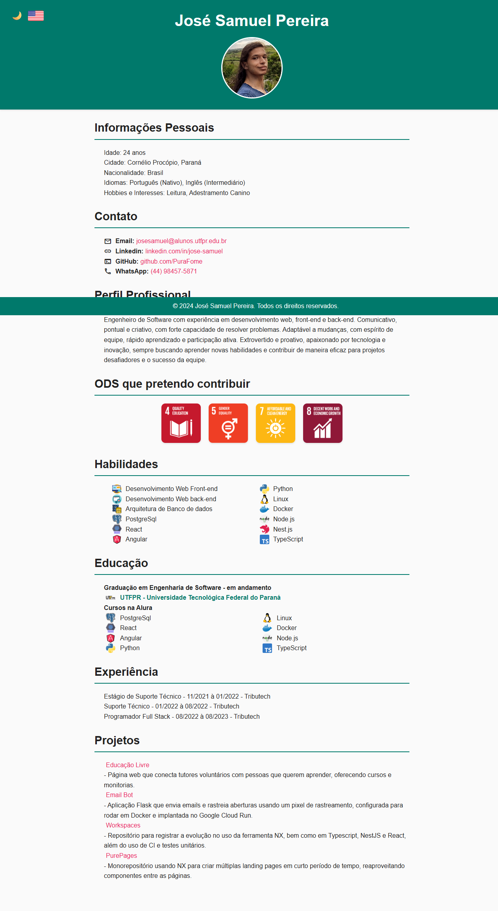

# José Samuel Pereira - Currículo / Resume

---

## 🇧🇷 Português

### Sobre o Projeto

Currículo online desenvolvido com HTML, CSS e JavaScript puros -- sem frameworks ou dependências externas. Hospedado no GitHub Pages.

### Funcionalidades

- 🌙 Alternar tema claro/escuro
- 🌐 Alternar idioma português/inglês
- 🖨️ Exportar para PDF (impressão)
- 📱 Layout responsivo

### Tecnologias

- HTML5, CSS3, JavaScript (vanilla)

### Status do Projeto

🚧 Em desenvolvimento -- melhorias contínuas de conteúdo e design.

### Acesso

🔗 [https://purafome.github.io/curriculo/](https://purafome.github.io/curriculo/)

---

## 🇬🇧 English

### About the Project

Online resume built with pure HTML, CSS, and JavaScript -- no frameworks or external dependencies. Hosted on GitHub Pages.

### Features

- 🌙 Dark/light theme toggle
- 🌐 Portuguese/English language toggle
- 🖨️ Export to PDF (print)
- 📱 Responsive layout

### Technologies

- HTML5, CSS3, JavaScript (vanilla)

### Project Status

🚧 In development -- continuous content and design improvements.

### Live Demo

🔗 [https://purafome.github.io/curriculo/](https://purafome.github.io/curriculo/)

---

## Author

- **José Samuel Pereira** - [@PuraFome](https://github.com/PuraFome)
- 📧 josesamuel@alunos.utfpr.edu.br
- 💼 [LinkedIn](https://www.linkedin.com/in/jos%C3%A9-samuel-pereira-6890a9247/)

## License

This project is licensed under the MIT License - see the [LICENSE](LICENSE) file for details.
